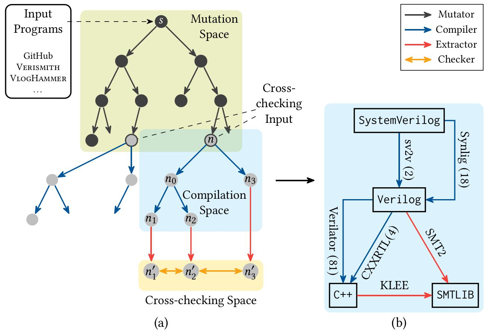

# VeriXmith

<div align="center">



</div>

VeriXmith interlinks design tools involved in logical synthesis and simulation for cross-checking. These tools process circuit designs and produce outputs in different languages, such as Verilog netlists from synthesizers and C++ programs from simulators. Since these outputs represent the same circuit semantics, we can leverage this semantic consistency to verify the tools that translate one representation into another. Our approach involves creating semantics extractors to extend the range of circuit representations suitable for semantic equivalence checking by converting them into a canonical and comparable form. Additionally, we developed mutation operators for Verilog designs to introduce new data/control paths and language constructs, enhancing the diversity of circuit designs as test inputs.

VeriXmith currently depends on (a.k.a. cross-checks) the following projects:

- [yosys](https://github.com/YosysHQ/yosys)
- [verilator](https://github.com/verilator/verilator)
- [iverilog](https://github.com/steveicarus/iverilog)
- [sv2v](https://github.com/zachjs/sv2v)
- [synlig](https://github.com/chipsalliance/synlig)
- [verismith](https://github.com/ymherklotz/verismith)
- [VlogHammer](https://github.com/YosysHQ/VlogHammer)
- [tree-sitter-verilog](https://github.com/tree-sitter/tree-sitter-verilog)
- [klee](https://github.com/klee/klee)

## Installation

The simplest way: run VeriXmith in Docker (zero configuration needed).

```
python3 -m tools.deploy update-image
```

will automatically build a docker image named `verixmith`, by calling the following command:

```
DOCKER_BUILDKIT=1 docker build --network=host --platform=linux/amd64 -t verixmith .
```

([Typer](https://typer.tiangolo.com/) is needed to run script `tools/deploy/__main__.py`.)

## Usage

There are three ways to work with VeriXmith:

1. VeriXmith can be used as a Python library. API functions such as `run_validation()` are provided in `core/api.py`.
2. VeriXmith uses [Invoke](https://www.pyinvoke.org/) to run its APIs from CLI. Therefore, one can use a command line like `inv run-validation ...` to run VeriXmith. Run `inv --list` to see all available tasks.
3. `tools/deploy/__main__.py` is a script built on top of `tasks.py`. It is helpful when starting a group of experiments on remote servers is needed.

### Getting Started

Start a cross-checking process with a fixed set of Verilog or SystemVerilog examples:

```
python3 -m tools.deploy batch-test example1 examples/verilog/ failures/ 10 VerilogCircuit SmtCircuit
python3 -m tools.deploy batch-test example2 examples/systemverilog/ failures/ 10 SystemVerilogCircuit VerilogCircuit
```

- **Explanation**: `batch-test` searches input programs from `examples/verilog/` (or `examples/systemverilog/`), samples `10` nodes in the compilation space, and saves all output to `failures/` after cross-checking.

Run the following command to get information of all available commands:

```
python3 -m tools.deploy --help
```

## Internals

### Directory Description

```
.
├── core                # Source code of VeriXmith in Python
├── dependencies        # Patched versions or patches of KLEE, PySmt, and Verilator
├── Dockerfile
├── examples            # Verilog and SystemVerilog examples
├── README.md
├── requirements.txt    # Required Python packages
├── tasks.py            # A CLI-invokable wrapper for functions in core/api.py
└── tools               # Useful scripts (start Docker containers, process bug reports, etc.)
```

### Primary Classes

- `Circuit` (defined in [circuit.py](./core/circuits/circuit.py)). This class represents circuit designs. Its subclasses cover all the nodes in Figure (b) above (e.g., `VerilogCircuit`, `CppCircuit`). Circuits may be in the same language (e.g., C++) but produced by different compilers (e.g., Yosys and Verilator both produce C++ simulators). Thus, specific subclasses such as `VerilatorCppCircuit` and `YosysCppCircuit` are defined under `CppCircuit`.
  - The `is_equivalent_to()` method enables equivalence checking for circuit representations.
- `MetaTranslator` (defined in [translator.py](./core/translators/translator.py)). Each compiler supported by VeriXmith has a corresponding `MetaTranslator` class.
  - The class variable `edges` specifies input and output formats.
  - The class variable `alternative_options` lists command-line options.
  - The `translate()` method takes a `Circuit` object as the compiler's input, performs compilation with given options, and returns the resulting `Circuit` object.

### Mutators

14 semantic-aware simulators are implemented through tree-sitter-verilog. They can be found in [heuristics.py](./core/mutators/heuristics.py).

| Name (Type) 	| Description 	|
|---	|---	|
| MakeRepeat (P) 	| Move an existing statement into a `repeat` loop. 	|
| MakeLoopGenerate (P) 	| Move an existing statement into a `for` loop. 	|
| ChangeIfCond (C) 	| Merge two `if-else` statements with conditions $c_1$ and $c_2$ respectively into one `if-else` statement with a new condition constructed from $c_1$ and $c_2$, e.g., ($c_1$ \|\| $c_2$). 	|
| RemoveIfCond (C) 	| Make one branch of an `if-else` statement unconditional by removing the other branch of the conditional statement. 	|
| SplitIfStatement (C) 	| Split one `if-else` statement into two `if-else` statements. Each new statement holds the same condition and part of the logic from the original branch(es). 	|
| MakeFunction (D) 	| Construct a function definition from an expression and inject random function calls to this function in the module containing that expression. 	|
| DuplicateModule (D) 	| Make a renamed copy of a module that is instantiated multiple times and redirect a subset of the instantiations of this module to the new one. 	|
| SplitAssignment (D) 	| Split a non-blocking or continuous assignment into several assignments, in which each assignment computes 1 bit. 	|
| LoopAssignment (D) 	| Convert a non-blocking or continuous assignment into a `for` loop, in which each iteration computes 1 bit. 	|
| DuplicateAssignment (D) 	| Append a new assignment to 1 bit of the left value of an existing assignment after it. 	|
| MakeArray (D) 	| Turn an existing non-array net or variable into an array of random dimensions. <br>  Assignments to this net/variable write to all array elements;<br>  uses of this net/variable are replaced with one random array element. 	|
| ChangeUnaryOp (D) 	| Replace one unary operator with another. 	|
| ChangeBinaryOp (D) 	| Replace one binary operator with another. 	|
| DuplicateExpr (D) 	| Replace an expression $e$ with a new expression constructed from itself (e.g., ($e$ \& $e$)). 	|

## Known limitations

1. Declaring a port as: (1) `output reg`; (2) `inout`; or (3) null; is not supported. This is caused by the Verilog frontend together with JSON backend of Yosys, which is adopted by VeriXmith to extract the input/output ports of the circuits.
2. Module named `main` will be renamed silently by Verilator, causing unexpected problems.
3. Escape names are not well supported by Yosys, e.g.:
   ```verilog
   // Generated by vlog-hammer
   module expression_00084;
      wire [5:0] \y11[0] ;
      wire [5:0] \y11[1] ;
      wire [5:0] \y11[2] ;
      wire [4:0] \y11[3] ;
      assign \y11[0]  = 6'h00;
      assign \y11[1]  = 6'h00;
      assign \y11[2]  = 6'h00;
      assign \y11[3] [3:0] = 4'hc;
   endmodule
   ```

Before performing cross-checking with any circuit design, make sure it is synthesizable, deterministic, and free of these patterns.
